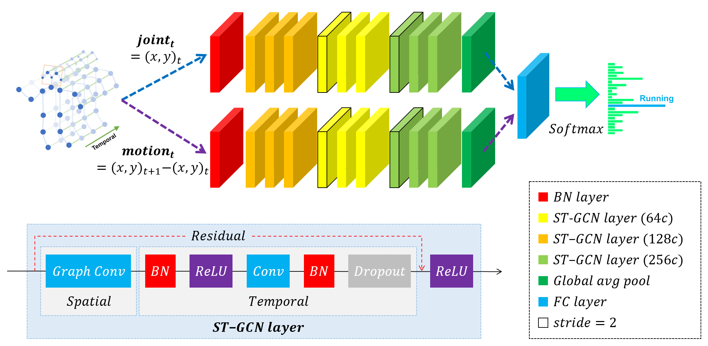

# Two Stream ST-GCN

## Introduction
This repository holds the code for my project.    
In the project I proposed a new model, two stream ST-GCN.

<div align="center">
    
</div>

## Prerequisites
- Python3 (>3.5)
- [PyTorch](http://pytorch.org/)
- Other Python libraries can be installed by `pip install -r requirements.txt`

### Installation
``` shell
git clone https://github.com/littlepure2333/2s_st-gcn.git 
cd st-gcn
cd torchlight
python setup.py install
cd ..
```

## Data Preparation

We experimented on two skeleton-based action recognition datasts: **Kinetics-skeleton** and **NTU RGB+D**.
and my own dataset: **NMV**   
Before training and testing, for convenience of fast data loading,
the datasets should be converted to proper file structure. 
You can download the pre-processed data from 
[GoogleDrive](https://drive.google.com/open?id=103NOL9YYZSW1hLoWmYnv5Fs8mK-Ij7qb)
and extract files with
``` 
cd st-gcn
unzip <path to st-gcn-processed-data.zip>
```
Otherwise, for processing raw data by yourself,
please refer to below guidances.

#### Kinetics-skeleton
[Kinetics](https://deepmind.com/research/open-source/open-source-datasets/kinetics/) is a video-based dataset for action recognition which only provide raw video clips without skeleton data. Kinetics dataset include To obatin the joint locations, we first resized all videos to the resolution of 340x256 and converted the frame rate to 30 fps.  Then, we extracted skeletons from each frame in Kinetics by [Openpose](https://github.com/CMU-Perceptual-Computing-Lab/openpose). The extracted skeleton data we called **Kinetics-skeleton**(7.5GB) can be directly downloaded from [GoogleDrive](https://drive.google.com/open?id=1SPQ6FmFsjGg3f59uCWfdUWI-5HJM_YhZ) or [BaiduYun](https://pan.baidu.com/s/1dwKG2TLvG-R1qeIiE4MjeA#list/path=%2FShare%2FAAAI18%2Fkinetics-skeleton&parentPath=%2FShare).

After uncompressing, rebuild the database by this command:
```
python tools/kinetics_gendata.py --data_path <path to kinetics-skeleton>
```

#### NTU RGB+D
NTU RGB+D can be downloaded from [their website](http://rose1.ntu.edu.sg/datasets/actionrecognition.asp).
Only the **3D skeletons**(5.8GB) modality is required in our experiments. After that, this command should be used to build the database for training or evaluation:
```
python tools/ntu_gendata.py --data_path <path to nturgbd+d_skeletons>
```
where the ```<path to nturgbd+d_skeletons>``` points to the 3D skeletons modality of NTU RGB+D dataset you download.

#### NMV
This is personal dataset, no plan to publish.

## Training
To train a new model or reproduce experiment results, run

```
python main.py recognition -c config/st_gcn.twostream/<dataset>/train.yaml [--work_dir <work folder>]
```
where the ```<dataset>``` must be ```ntu-xsub```, ```ntu-xview``` or ```kinetics-skeleton```, depending on the dataset you want to use.
The training results, including **model weights**, configurations and logging files, will be saved under the ```./work_dir``` by default or ```<work folder>``` if you appoint it.

You can modify the training parameters such as ```work_dir```, ```batch_size```, ```step```, ```base_lr``` and ```device``` in the command line or configuration files. The order of priority is:  command line > config file > default parameter. For more information, use ```main.py -h```.

Finally, custom model evaluation can be achieved by this command as we mentioned above:
```
python main.py recognition -c config/st_gcn.twostream/<dataset>/test.yaml --weights <path to model weights>
```

## Demo
You can use the following commands to run the demo.

```shell
# with offline pose estimation
python main.py demo_offline [--video ${PATH_TO_VIDEO}]

# with realtime pose estimation
python main.py demo [--video ${PATH_TO_VIDEO}]
```

Optional arguments:
- `PATH_TO_VIDEO`: Filename of the input video.
